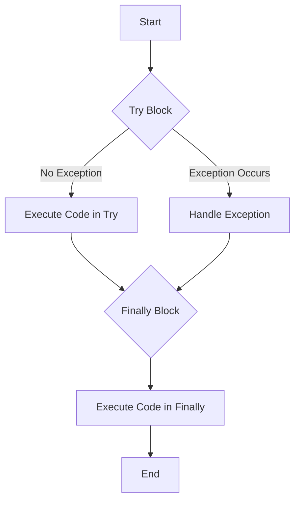
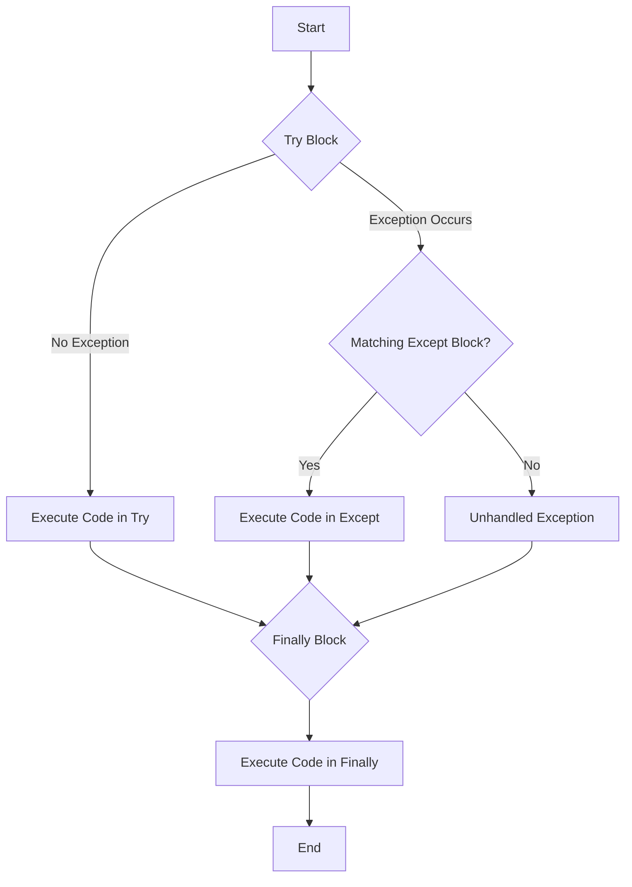

# 📝 Week 4, Day 19:  File and Exception Handling in Python

**Date: 25-7-2025 Friday
## 📂 File Handling

File handling is a crucial part of any web application. It allows us to create, read, update, and delete files. Python has several functions for creating, reading, updating, and deleting files.

### Основные операции с файлами

There are three basic modes of file operations:
*   **Read (`r`)**: To read the contents of a file.
*   **Write (`w`)**: To write new content to a file. **Be careful**, as this will overwrite any existing content.
*   **Append (`a`)**: To add new content to the end of a file without overwriting the existing content.

Here's a summary of the file modes:

| Mode | Description |
| :--- | :--- |
| `r` | **Read (default):** Opens a file for reading. Raises an error if the file does not exist. |
| `w` | **Write:** Opens a file for writing. Creates the file if it does not exist, and overwrites the content if it does. |
| `a` | **Append:** Opens a file for appending. Creates the file if it does not exist and adds new content to the end. |
| `r+` | **Read and Write:** Opens a file for both reading and writing. |
| `w+` | **Write and Read:** Opens a file for both writing and reading. Overwrites the existing file if it exists. |
| `a+` | **Append and Read:** Opens a file for both appending and reading. |

---

### 📖 Reading a File

To read a file, you first need to `open()` it in read mode (`'r'`). After you are done, it's important to `close()` the file to free up system resources.

**Example:**
```python
# Open the file in read mode
file = open("your_file.txt", 'r')

# Read the entire content of the file
print(file.read())

# Close the file
file.close()
```

### ✍️ Writing to a File

To write to a file, you open it in write mode (`'w'`). This will create the file if it doesn't exist, or clear it and write new content if it does.

**Example:**
```python
# Open the file in write mode
file = open("new_file.txt", 'w')

# Write content to the file
file.write("This is a new line written to the file.")

# Close the file
file.close()
```

### ➕ Appending to a File

If you want to add content to an existing file without deleting its current content, you should open it in append mode (`'a'`).

**Example:**
```python
# Open the file in append mode
file = open("existing_file.txt", 'a')

# Append a new line to the file
file.write("\nThis is another line appended to the file.")

# Close the file
file.close()
```

---

## 🛡️ The `try-finally` Block: Ensuring Files are Closed

It's a best practice to use a `try-finally` block when working with files. This ensures that the file is closed, even if an error occurs while processing it.

### Flow of `try-finally`

Here is a visual representation of how the `try-finally` block works:



**Example:**

This code ensures that `file.close()` is always called.

```python
try:
    file = open("my_file.txt", 'r')
    print(file.read())
finally:
    file.close()
    print("\nFile is closed!")
```

---

## 💣 Exception Handling

Exceptions are errors that occur during the execution of a program. Python has a way to handle these exceptions using `try`, `except`, and `finally` blocks. This prevents the program from crashing and allows it to handle errors gracefully.

### The `try-except` Block

The `try` block lets you test a block of code for errors. The `except` block lets you handle the error.

### Flow of `try-except`


#### Common Exceptions

*   `ValueError`: Raised when a function receives an argument of the correct type but an inappropriate value.
*   `ZeroDivisionError`: Raised when the second argument of a division or modulo operation is zero.
*   `FileNotFoundError`: Raised when a file or directory is requested but doesn't exist.

**Example: Handling `ValueError`**

If the user enters text instead of a number, a `ValueError` will occur. We can catch this and ask for the correct input.

```python
try:
    num = int(input("Please enter a value: "))
    print("You entered:", num)
except ValueError:
    print("Please enter a valid number!")
```

**Example: Handling Multiple Exceptions**

You can handle multiple exceptions in a single `except` block.

```python
try:
    num1 = int(input("Enter a number: "))
    num2 = int(input("Enter another number: "))
    result = num1 / num2
    print("The division is:", result)
except (ValueError, ZeroDivisionError):
    print("You have entered incorrect input or are trying to divide by zero!")

```

### Putting It All Together: `try-except-finally`

You can combine `try`, `except`, and `finally` to create a robust error-handling mechanism.

### Flow of `try-except-finally`



**Example: Reading a File with Full Exception Handling**

This example attempts to read a file that the user specifies. It handles the case where the file is not found and ensures the file is closed, regardless of whether an error occurred.

```python
try:
    file_name = input("Please enter the file name along with the extension: ")
    file = open(file_name, 'r')
    print(file.read())
except FileNotFoundError:
    print("Please enter the correct filename or path!")
finally:
    # This will cause an error if the file was never opened.
    # A better approach is to check if the 'file' variable exists.
    if 'file' in locals() and not file.closed:
        file.close()
        print("\nFile is closed!")

```