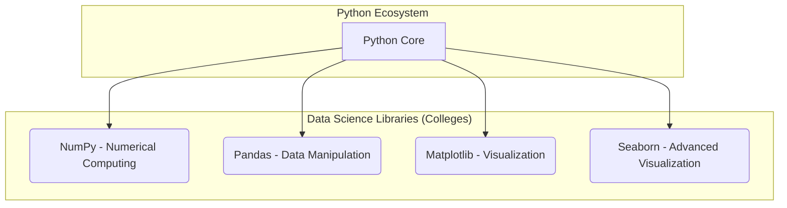
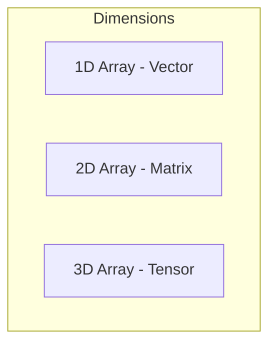
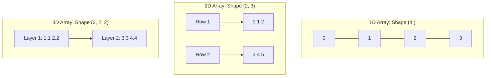
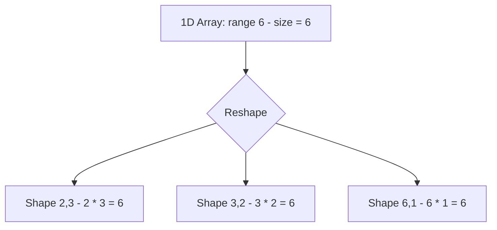

# Week 5, Day 20: Introduction to NumPy for Data Science

**Date: 28-7-2025 Monday

Welcome to your first formal session on Python for Data Science! Building on your Python programming foundation, we now dive into **NumPy** (*Numerical Python*), the cornerstone library for numerical and scientific computing in Python.

## The Python for Data Analysis Ecosystem

Python's power in data analysis comes from its vast collection of specialized libraries. Think of Python as a large university campus (like "Osmania" in your notes). This campus has different colleges for various fields of study. Similarly, Python has different libraries for various data-related tasks.



For this module, we'll focus on these four key libraries.

## 1. NumPy: The Foundation for Numerical Computing

NumPy introduces a powerful new data structure called the **array**. This is the workhorse for all things numerical in Python.

### Python Lists vs. NumPy Arrays

You're already familiar with Python lists. So, why do we need a new data structure? The key difference lies in performance and specialization.

| Feature | Python Lists | NumPy Arrays |
| --- | --- | --- |
| **Data Type** | **Heterogeneous** (can store different data types, e.g., `[1, "apple", 3.14]`) | **Homogeneous** (all elements must be the same data type, e.g., `[1, 2, 3]`) |
| **Performance** | Slower for numerical operations | Significantly faster due to optimized, low-level implementation (in C) and contiguous memory storage |
| **Primary Use** | General-purpose storage and data collection | Complex mathematical and numerical calculations |

### Creating a NumPy Array

First, you need to import the library. The standard convention is to import it with the alias `np`.

```python
import numpy as np
```

You can then create an array using `np.array()`, which can take various collection types as input:

*   Lists: `np.array([1, 2, 3])`
*   Tuples: `np.array((1, 2, 3))`
*   Ranges: `np.array(range(10))`

### Essential Array Attributes

Every NumPy array comes with a set of attributes that describe its properties. These are crucial for understanding the structure of your data.

*   `arr.ndim`: Returns the number of dimensions of the array.
*   `arr.shape`: Returns a tuple representing the size of each dimension.
*   `arr.size`: Returns the total number of elements in the array.
*   `arr.dtype`: Returns the data type of the elements in the array.

**Example:**

```python
arr = np.array([1, 2, 3, 4])

print(f"Type: {type(arr)}")         # Output: <class 'numpy.ndarray'>
print(f"Dimensions: {arr.ndim}")      # Output: 1
print(f"Shape: {arr.shape}")          # Output: (4,)
print(f"Size: {arr.size}")            # Output: 4
print(f"Data Type: {arr.dtype}")      # Output: int64 (or int32 depending on your system)
```

## Understanding Array Dimensions and Shape

The concept of dimensions and shape is fundamental to working with NumPy.




### 1. One-Dimensional (1D) Array

*   **Analogy:** A single row of numbers.
*   **Shape:** `(rows,)`
*   **Example:** `np.array([0, 1, 2, 3])` has a shape of `(4,)`.

### 2. Two-Dimensional (2D) Array

*   **Analogy:** A table with rows and columns.
*   **Shape:** `(rows, columns)`
*   **Example:** `np.array([[0, 1, 2], [3, 4, 5]])` has a shape of `(2, 3)`.

### 3. Three-Dimensional (3D) Array

*   **Analogy:** A collection of tables (or layers of 2D arrays).
*   **Shape:** `(layers, rows, columns)`
*   **Example:** `np.array([[[1,1], [2,2]], [[3,3], [4,4]]])` has a shape of `(2, 2, 2)`.

**A key rule for creating multi-dimensional arrays manually is that the length of each inner list at the same level must be identical.**

## Dynamic Array Creation with `reshape`

Manually creating large, multi-dimensional arrays is tedious. A more efficient "dynamic" method is to create a 1D array and then **reshape** it.

The `reshape(shape)` method allows you to change the shape of an array without altering its data.

**Rule:** The product of the new shape's dimensions must equal the total number of elements (`size`) of the original array.

**Example:**
If you have a 1D array with 6 elements:
`arr = np.array([0, 1, 2, 3, 4, 5])` which has a `size` of 6.

You can reshape it into any of the following valid shapes:
*   `(1, 6)`
*   `(6, 1)`
*   `(2, 3)`
*   `(3, 2)`



**Code Example:**

```python
# Create a 1D array of 24 numbers
arr_1d = np.array(range(24))

# Reshape it into a 3D array of shape (2, 3, 4)
# (2 * 3 * 4 = 24, so this is a valid shape)
arr_3d = arr_1d.reshape(2, 3, 4)

print(arr_3d)
```

This method is incredibly useful for quickly generating structured data for testing and analysis.

---