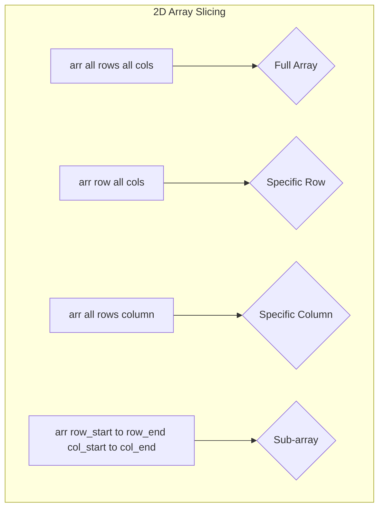

# Week 5, Day 21: Introduction to NumPy Part 2

**Date:** 29-7-2025

**Topic:** NumPy Array Creation and Accessing Elements
## 1. Introduction to NumPy

NumPy, which stands for Numerical Python, is a fundamental package for numerical computing in Python. It provides a powerful N-dimensional array object, and tools for working with these arrays.

### Why NumPy?

*   **Performance:** NumPy arrays are more compact and faster than traditional Python lists.
*   **Functionality:** It provides a large collection of high-level mathematical functions to operate on these arrays.
*   **Data Science:** NumPy is the foundation of the data science ecosystem in Python, with libraries like Pandas, Matplotlib, and Scikit-learn built on top of it.

### NumPy Array: The Core Data Structure

The core of NumPy is the `ndarray` (N-dimensional array), which is a grid of values, all of the same type.

*   **Homogeneous:** All elements in a NumPy array must be of the same data type.
*   **Dimensions (Axes):** Arrays can have multiple dimensions.
    *   **1D Array:** A single row of elements (like a vector).
    *   **2D Array:** A table of elements with rows and columns (like a matrix).
    *   **3D Array:** A collection of 2D arrays (like a cube).

## 2. Creating NumPy Arrays

There are several ways to create NumPy arrays, either manually or using built-in functions.

### Manual Creation

You can create arrays from Python lists or tuples using `np.array()`.

```python
import numpy as np

# 1D Array
arr1d = np.array([1, 2, 3, 4, 5])

# 2D Array
arr2d = np.array([[1, 2, 3], [4, 5, 6]])

# 3D Array
arr3d = np.array([[[1, 2], [3, 4]], [[5, 6], [7, 8]]])
```

### Dynamic Creation using NumPy Functions

NumPy provides several functions to create arrays with initial placeholders or sequences.

| Function | Description | Example |
| :--- | :--- | :--- |
| `np.arange()` | Create an array with a range of values. | `np.arange(0, 10, 2)` |
| `np.linspace()` | Create an array with a specific number of evenly spaced values. | `np.linspace(0, 10, 5)` |
| `np.ones()` | Create an array of a given shape, filled with ones. | `np.ones((2, 3))` |
| `np.zeros()` | Create an array of a given shape, filled with zeros. | `np.zeros((2, 3))` |
| `np.identity()` | Create a square identity matrix. | `np.identity(3)` |
| `np.random.randint()`| Create an array with random integers. | `np.random.randint(0, 10, (2, 3))` |

### Array Attributes

You can get information about an array using its attributes:

| Attribute | Description |
| :--- | :--- |
| `ndim` | Number of dimensions. |
| `shape` | A tuple representing the size of each dimension. |
| `size` | The total number of elements. |
| `dtype` | The data type of the elements. |

## 3. Accessing and Slicing Arrays

You can access and manipulate parts of arrays using indexing and slicing.

### Indexing

*   **1D Array:** `arr[index]`
*   **2D Array:** `arr[row, column]`
*   **3D Array:** `arr[layer, row, column]`

### Slicing

Slicing allows you to select a range of elements. The syntax is `start:stop:step`.

*   **1D Array:** `arr[start:stop]`
*   **2D Array:** `arr[row_slice, col_slice]`
*   **3D Array:** `arr[layer_slice, row_slice, col_slice]`

### Visualizing Array Access



### Flipping Arrays

You can reverse the order of elements along a specific axis using slicing with a step of -1.

*   **Flip rows:** `arr[::-1]`
*   **Flip columns:** `arr[:, ::-1]`
*   **Flip layers (3D):** `arr[::-1]`

## 4. Hands-on Examples

### Creating Arrays

```python
# Create a 2D array of shape (3, 4) with values from 1 to 12
arr2d = np.arange(1, 13).reshape(3, 4)

# Create a 3D array of shape (3, 2, 4)
arr3d = np.arange(1, 25).reshape(3, 2, 4)

# Create a 2D array of shape (3, 5) with 15 evenly spaced numbers between 2 and 100
arr2d_linspace = np.linspace(2, 100, 15).reshape(3, 5)
```

### Accessing Elements

```python
# Create a 3x3 array
arr = np.array([[1, 2, 3], [4, 5, 6], [7, 8, 9]])

# Display the last row
print(arr[-1])  # Output: [7 8 9]

# Display the first column
print(arr[:, 0])  # Output: [1 4 7]

# Display the middle element
print(arr[1, 1])  # Output: 5

# Display the first two rows and first two columns
print(arr[:2, :2])
# Output:
# [[1 2]
#  [4 5]]
```

### Accessing in 3D

```python
# Create a 3D array
arr3d = np.arange(1, 61).reshape(3, 4, 5)

# Display the second layer
print(arr3d[1])

# Display the last row of the first layer
print(arr3d[0, -1])

# Display a portion of the second layer
print(arr3d[1, 1:, 2:])
```

These notes provide a comprehensive overview of the topics covered in today's class. You can directly copy and paste this into your Obsidian vault or a GitHub repository's README file. The Mermaid diagram will render automatically in both platforms.
