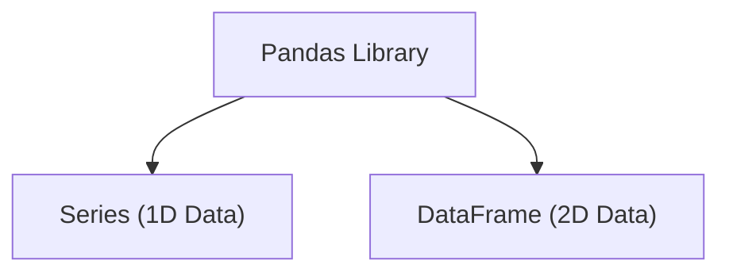
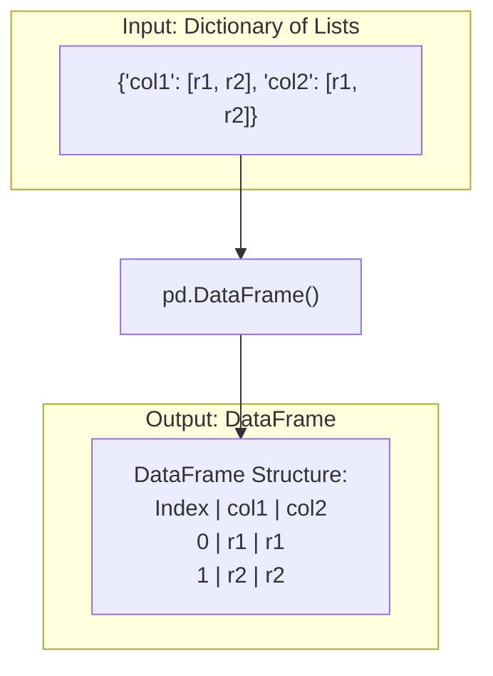

# Week 5, Day 23:  Introduction to Pandas

**Date:** August 1, 2025
**Topic:** Pandas Fundamentals - Data Structures & File I/O

---

#### **1. What is Pandas?**

*   A fundamental Python library for data manipulation and analysis.
*   It introduces two primary data structures that we will work with: `Series` and `DataFrame`.



---

#### **2. The Pandas `Series`**

> **Definition:** A **`Series`** is a one-dimensional array-like object that can hold any data type. It has an associated array of data labels, called its **index**.

*   **Creating a `Series`:** We use the `pd.Series()` constructor.

    *   **From a list (most common):**
        ```python
        import pandas as pd
        # The index is automatically generated (0, 1, 2...)
        ser1 = pd.Series([10, 20, 30])
        ```
        *Output:*
        ```
        0    10
        1    20
        2    30
        dtype: int64
        ```

    *   **From a dictionary:**
        ```python
        # The dictionary keys are used as the index
        di = {101: "Riyan", 102: "Amaan", 103: "Adnan"}
        s = pd.Series(di)
        ```
        *Output:*
        ```
        101    Riyan
        102    Amaan
        103    Adnan
        dtype: object
        ```

---

#### **3. The Pandas `DataFrame`**

> **Definition:** A **`DataFrame`** is a 2-dimensional, tabular data structure with labeled axes (rows and columns). It's like a spreadsheet or an SQL table.

*   **Creating a `DataFrame`:** The most common way is from a **dictionary of collections** (like lists, arrays, or other Series).
    *   The dictionary keys become the **column names**.
    *   The values in the collections become the **rows** of data.



**Examples of DataFrame Creation:**

1.  **From a Dictionary of Lists:**
    ```python
    di = {
        'Name': ['Riyan', 'Amaan', 'Adnan'],
        'age': [20, 22, 23],
        'Course':['Ds', 'DevOP', 'Bussiness']
    }
    df = pd.DataFrame(di)
    ```
    
    *Resulting Table:*
    
| | Name | age | Course |
| :-- | :--- | :-: | :--- |
| 0 | Riyan | 20 | Ds |
| 1 | Amaan | 22 | DevOP |
| 2 | Adnan | 23 | Bussiness|

2.  **From a Dictionary of NumPy Arrays:**
    ```python
    import numpy as np
    name = np.array(['Riyan','Amaan','Adnan'])
    course = np.array(['DS','DevOps','WebDev'])
    score = np.array([44,46,78])

    di = {'Name':name, 'Course':course, 'Score':score}
    df2 = pd.DataFrame(di)
    ```

#### **4. Inspecting Your DataFrame**

Once you have a DataFrame, you can check its properties.

*   `df.ndim`: Number of dimensions. For a DataFrame, this is always **2**.
*   `df.shape`: Returns a tuple of `(rows, columns)`. Very useful!
*   `df.size`: Total number of elements (`rows * columns`).

---

#### **5. Custom Indexing**

By default, the index is `0, 1, 2, ...`. We can assign a more meaningful index during creation.

> **Key Point:** The `index` parameter in `pd.DataFrame()` must have the same number of elements as the number of rows in your data.

```python
# The 'index' list provides the row labels
df_custom = pd.DataFrame(
    {
        'course': ['DS', 'DevOps', 'WebDev'],
        'score': [90, 80, 60]
    }, 
    index=['Riyan', 'Amaan', 'Adnan']
)
```
*Resulting Table with Custom Index:*

| | course | score |
|:---|:---|:---|
| **Riyan** | DS | 90 |
| **Amaan** | DevOps | 80 |
| **Adnan** | WebDev | 60 |

---

#### **6. Reading Data From Files**

This is how we'll work with real-world datasets.

*   **Core Functions:**
    *   `pd.read_csv('filename.csv')` for Comma-Separated Values files.
    *   `pd.read_excel('filename.xlsx')` for Excel files.

*   **Two Scenarios for File Paths:**

    1.  **File in the Same Location:** If the notebook (`.ipynb`) and the data file (`.csv`) are in the same folder, you just need the file's name.
        ```python
        df = pd.read_csv('FinData.csv') 
        ```

    2.  **File in a Different Location:** You must provide the full file path.
        > **Important:** On Windows, you must either use double backslashes (`\\`) or a single forward slash (`/`) to avoid errors.
        ```python
        # Windows Example
        df = pd.read_excel("C:\\Users\\uwais\\Downloads\\DA1 Score.xlsx")
        
        # Mac/Linux Example
        df = pd.read_csv('/home/riyan/Desktop/dataset.csv')
        ```