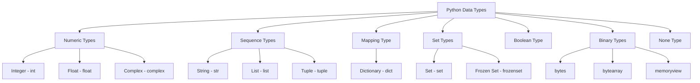

### Variables: The Labeled Boxes of Programming

A variable is a name you give to a memory location to store a piece of data. Think of it as a labeled box where you can put information.

-   **Identifier:** The name of the variable (e.g., `age`).
-   **Assignment Operator:** The equals sign (`=`), which tells Python to "put the value on the right into the variable on the left."
-   **Data/Value:** The information stored in the variable (e.g., `28`).

```python
# identifier   assignment   data/value
name         =            "Uwaish"
age          =            28
```

**Rules for Identifiers (Variable Names):**
*   Must start with a letter (a-z, A-Z) or an underscore (`_`).
*   Cannot start with a number.
*   Can only contain letters, numbers, and underscores.
*   Are case-sensitive (`age` is different from `Age`).

### Operators: The Tools for Doing Work

Operators are special symbols that perform operations on variables and values.

| Category | Operators | What they do |
| :--- | :--- | :--- |
| **Arithmetic** | `+`, `-`, `*`, `/`, `%` | Perform mathematical calculations. The **modulo (`%`)** gives the remainder of a division. |
| **Assignment** | `=` | Assigns a value to a variable. |
| **Comparison** | `==`, `!=`, `>`, `<` | Compares two values and results in `True` or `False`. |
| **Logical** | `and`, `or`, `not` | Combines conditional statements. |

### Data Types: The Different Kinds of Information

Python needs to know what *kind* of data it's working with. Here's a recap:

**1. Basic (Primitive) Types:**
*   **Integer (`int`):** Whole numbers, like `10`, `-50`, `1000`.
*   **Float (`float`):** Numbers with a decimal point, like `22.5`, `3.14`.
*   **String (`str`):** Text, enclosed in single (`'`) or double (`"`) quotes.
*   **Boolean (`bool`):** Represents truth values, can only be `True` or `False`.

**2. Collection Types:** These are containers that hold other data.

### Deep Dive: A Comparison of Collection Types

This table summarizes everything you need to know about Python's four main collection types.

| Feature                | List                 | Tuple                 | Set               | Dictionary                 |
| :--------------------- | :------------------- | :-------------------- | :---------------- | :------------------------- |
| **Syntax (Shape)**     | `[ ]`                | `( )`                 | `{ }` or `set()`  | `{key: value}`             |
| **Is it Ordered?**     | **Yes**              | **Yes**               | **No**            | **Yes** (in Python 3.7+)   |
| **Is it Mutable?**     | **Yes** (changeable) | **No** (unchangeable) | **Yes**           | **Yes**                    |
| **Allows Duplicates?** | **Yes**              | **Yes**               | **No**            | Keys are unique            |
| **Indexed By?**        | Number [0, 1, 2...]  | Number [0, 1, 2...]   | Not indexed       | Key                        |
| **How to Update?**     | `my_list[0] = 'new'` | Cannot be updated     | N/A               | `my_dict['key'] = 'new'`   |
| **How to Add?**        | `my_list.append()`   | Concatenate `+`       | `my_set.add()`    | `my_dict['new_key'] = val` |
| **How to Delete?**     | `my_list.pop()`      | Cannot be deleted     | `my_set.remove()` | `my_dict.pop('key')`       |


### Understanding Python's Dynamic Typing

Python is a dynamically-typed language, which means you don't need to explicitly declare the data type of a variable. The interpreter determines the type at runtime based on the value assigned to it. You can always check the type of any variable using the built-in `type()` function.

```python
my_variable = "Hello, Python!"
print(type(my_variable))  # <class 'str'>

my_variable = 100
print(type(my_variable))  # <class 'int'>
```

### Main Categories of Python Data Types

Python's built-in data types can be grouped into several categories. Here’s a Mermaid diagram to visualize the classification:



---

### Detailed Guide to Python Data Types

Here is a detailed breakdown of each data type, including its purpose, how to create it, how to access its elements, and common operations.

#### 1. Numeric Types

Used to represent numerical values.

| Data Type | Description | Mutability | Example |
| :--- | :--- | :--- | :--- |
| **`int`** | Whole numbers, positive or negative, without decimals. | Immutable | `x = 100` |
| **`float`** | Numbers with a decimal point. | Immutable | `y = 20.5` |
| **`complex`** | Numbers with a real and imaginary part. | Immutable | `z = 1 + 2j` |

**Operations and Examples:**

```python
# Creation
a = 10
b = 3.14
c = a / 3 # Division always results in a float

# Operations
print(f"Addition: {a + b}")
print(f"Floor Division: {a // 3}") # Returns the integer part of the division
print(f"Exponentiation: {a ** 2}")

# Accessing parts of a complex number
z = 1 + 2j
print(f"Real part: {z.real}")
print(f"Imaginary part: {z.imag}")
```

#### 2. Sequence Types

Used to store ordered collections of items.

| Data Type   | Description                                                             | Mutability | Example              |
| :---------- | :---------------------------------------------------------------------- | :--------- | :------------------- |
| **`str`**   | An ordered sequence of Unicode characters.                              | Immutable  | `s = "Python"`       |
| **`list`**  | An ordered, flexible collection that can hold items of different types. | Mutable    | `l = [1, "a", 3.14]` |
| **`tuple`** | An ordered, fixed collection. Faster than lists but cannot be modified. | Immutable  | `t = (1, "a", 3.14)` |

**Accessing Elements (Indexing and Slicing):**

All sequence types use zero-based indexing.

```python
my_list = ['P', 'y', 't', 'h', 'o', 'n']
#          0    1    2    3    4    5
#         -6   -5   -4   -3   -2   -1

# Accessing
print(f"First element: {my_list[0]}")
print(f"Last element: {my_list[-1]}")

# Slicing
print(f"From index 2 to 4: {my_list[2:5]}") # Grabs elements at index 2, 3, 4
print(f"First three elements: {my_list[:3]}")
```

**Operations and Examples:**

```python
# --- String ---
my_string = "Hello"
# my_string[0] = 'h' # This would cause a TypeError because strings are immutable

# --- List ---
my_list = [1, 2, "three"]
my_list.append(4)       # Add an item to the end
my_list[1] = 'two'      # Modify an item
print(f"Modified List: {my_list}")

# --- Tuple ---
my_tuple = (1, 2, 3)
# my_tuple[0] = 0 # This would cause a TypeError

# Common sequence operations
print(f"Length of my_list: {len(my_list)}")
print(f"Concatenated tuple: {(1, 2) + (3, 4)}")
print(f"Repeated string: {'-' * 10}")
```

#### 3. Mapping Type

Used to store a collection of key-value pairs.

| Data Type | Description | Mutability | Example |
| :--- | :--- | :--- | :--- |
| **`dict`** | An unordered collection of unique, immutable keys mapped to values. | Mutable | `d = {"name": "Alice", "age": 30}` |

**Operations and Examples:**

```python
# Creation
person = {
    "name": "Bob",
    "age": 25,
    "is_student": True
}

# Accessing values by key
print(f"Name: {person['name']}")

# Adding or updating
person["age"] = 26 # Updates the value
person["city"] = "New York" # Adds a new key-value pair

# Removing items
removed_value = person.pop("is_student")
print(f"Dictionary after pop: {person}")

# Getting keys and values
print(f"Keys: {person.keys()}")
print(f"Values: {person.values()}")
```

#### 4. Set Types

Used to store unordered collections of unique items.

| Data Type | Description | Mutability | Example |
| :--- | :--- | :--- | :--- |
| **`set`** | An unordered collection of unique, immutable items. | Mutable | `s = {1, 2, 3}` |
| **`frozenset`**| An immutable version of a set. | Immutable | `fs = frozenset([1, 2, 3])`|

**Operations and Examples:**

Sets are excellent for performing mathematical set operations.

```python
set_a = {1, 2, 3, 4}
set_b = {3, 4, 5, 6}

# Creation
my_set = {1, 2, 2, 3} # Duplicates are automatically removed
print(f"My Set: {my_set}") # Output: {1, 2, 3}

# Operations
print(f"Union: {set_a | set_b}")         # All unique elements from both sets
print(f"Intersection: {set_a & set_b}")  # Elements present in both sets
print(f"Difference: {set_a - set_b}")    # Elements in set_a but not in set_b

# Modifying a set
my_set.add(4)
my_set.remove(1)
print(f"Modified Set: {my_set}")
```

#### 5. Boolean Type

Used to represent truth values.

| Data Type | Description | Mutability | Example |
| :--- | :--- | :--- | :--- |
| **`bool`** | Represents one of two values: `True` or `False`. | Immutable | `is_active = True` |

**Operations and Examples:**

Booleans are the foundation of control flow and logic.

```python
x = 10
y = 5

# Comparisons result in a boolean
print(f"Is x greater than y? {x > y}")

# Logical operations
is_sunny = True
is_warm = False
print(f"Go to the beach? {is_sunny and is_warm}") # Logical AND
print(f"Stay inside? {not is_warm}") # Logical NOT```
```

Any non-zero number or non-empty collection is evaluated as `True`, while `0`, `None`, and empty collections are `False`.

```python
print(f"Boolean value of 0: {bool(0)}")
print(f"Boolean value of []: {bool([])}")
print(f"Boolean value of 'Hello': {bool('Hello')}")
```

#### 6. Binary Types

Used to work with binary data (sequences of bytes).

| Data Type | Description | Mutability | Example |
| :--- | :--- | :--- | :--- |
| **`bytes`** | An immutable sequence of single bytes. | Immutable | `b = b'hello'` |
| **`bytearray`** | A mutable sequence of single bytes. | Mutable | `ba = bytearray(b'hello')` |
| **`memoryview`** | A memory view of a binary object without copying it. | (Depends on object) | `mv = memoryview(b'hello')` |

**Operations and Examples:**

```python
# Creation
my_bytes = b'Python'
my_bytearray = bytearray(b'Python')

# bytes are immutable
# my_bytes[0] = 80 # TypeError

# bytearray is mutable
my_bytearray[0] = 80 # 'P' becomes 'P'
print(f"Modified bytearray: {my_bytearray}")

# Decoding to a string
print(f"Decoded bytes: {my_bytes.decode('utf-8')}")
```

#### 7. The `None` Type

Used to represent the absence of a value.

| Data Type | Description | Mutability | Example |
| :--- | :--- | :--- | :--- |
| **`NoneType`**| Has only one value: `None`. | Immutable | `result = None` |

**Use Case:**

`None` is often used as a placeholder or to signify that a function has no meaningful value to return.

```python
def find_user(user_id):
    # Imagine searching a database...
    if user_id == 1:
        return {"name": "Alice"}
    else:
        return None # No user found

user = find_user(2)
if user is None:
    print("User not found.")
```