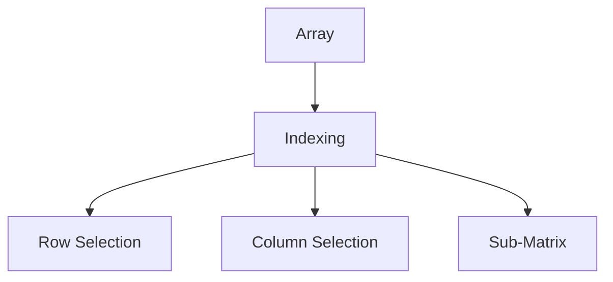
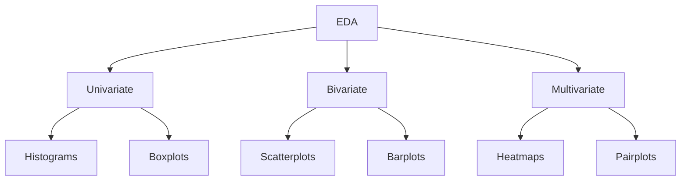

# 📘 Data Cleaning & EDA Learning Guide (Based on Your Code)

---

## 🔹 1. Python & NumPy Basics

### ✅ Concept: Importing Libraries

```python
import numpy as np
```

- **`import`** → loads a module/library so we can use its functions.
    
- **`numpy` (aliased as `np`)** → handles arrays, numerical computations, linear algebra.
    

---

### ✅ Concept: Creating Arrays

```python
arr = np.array([1,2,3,4])
```

- Creates a **NumPy array** from a Python list.
    
- Arrays are better than lists because they:
    
    - Allow **vectorized operations** (fast math without loops).
        
    - Store data in **continuous memory** (efficient).
        

|Method|Example|Output|
|---|---|---|
|`np.array([1,2,3])`|→ [1 2 3]|Simple array|
|`np.arange(5)`|→ [0 1 2 3 4]|Range of numbers|
|`np.linspace(1,10,5)`|→ [1, 3.25, 5.5, 7.75, 10]|Evenly spaced values|

---

### ✅ Concept: Checking Properties

```python
arr.ndim    # dimension
arr.shape   # rows, columns
arr.size    # total elements
arr.dtype   # data type
```

|Function|Meaning|Example|Output|
|---|---|---|---|
|`.ndim`|No. of dimensions|`[1,2,3]`|1|
|`.shape`|Rows × Columns|`[[1,2],[3,4]]`|(2,2)|
|`.size`|Total elements|`[1,2,3]`|3|
|`.dtype`|Data type|`[1,2,3]`|int64|

---

### ✅ Concept: Reshaping Arrays

```python
arr1d = np.array(range(9))
arr2d = arr1d.reshape(3,3)
```

- Converts 1D → 2D (or higher).
    
- Useful for **cleaning raw data** into structured form.
    

**Before vs After Example:**

|Before (1D)|After (2D)|
|---|---|
|`[0 1 2 3 4 5 6 7 8]`|`[[0 1 2] [3 4 5] [6 7 8]]`|

---

### ✅ Concept: Special Arrays

- `np.zeros((3,4))` → 3×4 matrix of zeros.
    
- `np.ones((2,3))` → 2×3 matrix of ones.
    
- `np.identity(3)` → identity matrix.
    
- `np.random.randint(100, size=(3,4))` → random integers.
    

💡 _Use case_: Generate synthetic datasets for testing cleaning/EDA functions.

---

### ✅ Concept: Indexing & Slicing

```python
arr[0]       # first element
arr[-1]      # last element
arr[1:3]     # slice
arr2d[:,0]   # first column
arr2d[-1]    # last row
```

**Visual (Mermaid):**



---

### ✅ Concept: Array Operations

```python
arr1 + arr2
np.add(arr1, arr2)
np.dot(arr1, arr2)
np.mean(arr)
```

|Function|Purpose|Example|
|---|---|---|
|`+`|Element-wise add|`[1,2]+[3,4]=[4,6]`|
|`np.multiply()`|Element-wise multiply||
|`np.dot()`|Matrix multiplication||
|`np.mean()`|Average||

---

### ✅ Concept: Broadcasting

```python
arr + [[100]]
```

- NumPy automatically **expands smaller arrays** to match shape.
    

---

---

## 🔹 2. Pandas Basics

### ✅ Concept: Series

```python
ser = pd.Series([10,20,30])
```

- A **1D labeled array**.
    
- Like Excel column.
    

|Function|Example|Output|
|---|---|---|
|`.ndim`|ser.ndim|1|
|`.shape`|ser.shape|(3,)|
|`.dtypes`|ser.dtypes|int64|

---

### ✅ Concept: DataFrames

```python
df = pd.DataFrame({'emp_id':[101,102], 'name':['A','B'], 'salary':[500,600]})
```

- **2D table** with rows & columns.
    
- Like Excel sheet.
    
- Each column = Series.
    

---

### ✅ Concept: Indexing

```python
df.iloc[0]         # row by position
df.loc['Aisha']    # row by label
df[['Name','Age']] # multiple cols
```  

---

### ✅ Concept: Filtering

```python
df[df['Age']>22]
df.loc[df['Role']=='DA','Emp_id']
```

- Essential for **cleaning dirty rows**.
    

---

### ✅ Concept: Handling Nulls

```python
df.isnull().sum()
df.fillna(0)
df.dropna()
```

|Method|Meaning|
|---|---|
|`.isnull()`|Identify NaN|
|`.fillna()`|Replace NaN|
|`.dropna()`|Remove NaN rows|

---

### ✅ Concept: Handling Duplicates

```python
df.duplicated().sum()
df.drop_duplicates()
```

---

### ✅ Concept: Outlier Detection

```python
df['Age'].describe()
df[df['Age']>40]
```

---

---

## 🔹 3. Data Cleaning Examples

### **Before vs After Cleaning**

|Before|After|
|---|---|
|`NaN, NaN, 200, 300`|`100, 150, 200, 300`|
|`Duplicate Rows`|`Unique Rows`|
|`56 (outlier in Age)`|`25 (replaced)`|

---

### ✅ Concept: Feature Engineering

```python
df['DOB'] = pd.to_datetime(df['DOB'])
df['Age'] = 2025 - df['DOB'].dt.year
```

- Extracts **new features** (Age, Year, Month) from raw data.
    

---

---

## 🔹 4. Visualization

### ✅ Matplotlib

```python
plt.hist(df['Profit'])
plt.plot(df['Year'],df['Profit'])
plt.scatter(df['Gross Sales'],df['Profit'])
```

### ✅ Seaborn

```python
sns.boxplot(df['Profit'])   # outlier detection
sns.barplot(x='Product', y='Profit', data=df)
sns.countplot(x='Segment', data=df)
```

|Chart|Purpose|
|---|---|
|Histogram|Distribution|
|Boxplot|Outlier detection|
|Scatter|Relationships|
|Barplot|Compare categories|
|Countplot|Frequency of categories|

---



---

## 🔹 5. Alternative Approaches

- Instead of:
    
    ```python
    df[df['Profit']>200]['Product']
    ```
    
    Use:
    
    ```python
    df.query("Profit > 200")['Product']
    ```
    
    → cleaner and faster.
    
- For missing values:
    
    - `Simple fillna()` → quick fix.
        
    - `Interpolation` → better for time-series.
        
    - `KNN imputer` (advanced, sklearn).
        


---

# 📘 Data Cleaning & EDA Revision Guide

### 🔖 Table of Contents

1. **NumPy Basics**
    
    - Array creation, indexing, reshaping, broadcasting
        
    - Mathematical operations
        
    - Practical use in cleaning
        
2. **Pandas Basics**
    
    - Series & DataFrames
        
    - Indexing, filtering
        
    - Missing values, duplicates, outliers
        
3. **Data Cleaning Techniques**
    
    - Handling NaN
        
    - Removing duplicates
        
    - Outlier detection & fixing
        
    - Feature engineering
        
4. **EDA (Exploratory Data Analysis)**
    
    - Univariate analysis
        
    - Bivariate & multivariate analysis
        
    - Grouping & aggregations
        
5. **Visualization (Matplotlib & Seaborn)**
    
    - Histograms, Boxplots, Scatterplots, Barplots
        
    - Countplots, Heatmaps, Pairplots
        
6. **Quick Reference (Cheat Sheet)**
    
    - One-liners for cleaning
        
    - Common plots for EDA
        
    - Alternatives (efficient tricks)
        

---

📑 The final guide will include:

- **Concepts → Example → Output (before & after)**
    
- **Mermaid flowcharts** (for process visualization)
    
- **Markdown tables** (for quick comparison)
    
- **Best practices + alternatives**
    

---
Perfect ⚡ Here’s your **1-Page Condensed Cheat Sheet** for **last-minute revision**.

---

# 📌 Data Cleaning & EDA – Quick Cheat Sheet

---

## 🔹 NumPy

```python
np.array([1,2,3])         # create
np.arange(0,10,2)         # [0 2 4 6 8]
np.linspace(1,10,5)       # evenly spaced
arr.reshape(3,3)          # reshape
arr.ndim, arr.shape, arr.size, arr.dtype
np.mean(arr), np.median(arr), np.std(arr)
```

---

## 🔹 Pandas

```python
pd.Series([1,2,3])
pd.DataFrame({'a':[1,2],'b':[3,4]})

df.head(), df.info(), df.describe()
df['col'].unique(), df['col'].nunique()
df['col'].value_counts()
```

**Indexing / Filtering**

```python
df.loc[0,'col']          # label
df.iloc[0,1]             # position
df[df['col']>10]         # filter
```

---

## 🔹 Cleaning

```python
df.isnull().sum()        
df.fillna(0)             # replace NaN
df.dropna()              # drop NaN
df.drop_duplicates()     # remove dups
```

**Outliers (IQR)**

```python
Q1, Q3 = df['col'].quantile([0.25,0.75])
IQR = Q3-Q1
df = df[(df['col']>=Q1-1.5*IQR) & (df['col']<=Q3+1.5*IQR)]
```

---

## 🔹 EDA

```python
df.describe()            
df.corr()                
df.groupby('cat')['num'].mean()
```

---

## 🔹 Visualization

**Matplotlib**

```python
plt.hist(df['col'])               
plt.scatter(df['x'],df['y'])
plt.plot(df['x'],df['y'])
```

**Seaborn**

```python
sns.histplot(df['col'])           # distribution
sns.boxplot(x=df['col'])          # outliers
sns.countplot(x='cat',data=df)    # freq
sns.barplot(x='cat',y='val',data=df)
sns.heatmap(df.corr(),annot=True) # correlation
```

---

## ⚡ Workflow (Exam Hack)

1. `df.head(), df.info(), df.describe()`
    
2. Handle missing → `fillna / dropna`
    
3. Remove duplicates → `drop_duplicates`
    
4. Fix outliers → IQR / Boxplot
    
5. Feature engineering → new cols
    
6. EDA → hist, box, scatter, heatmap
    
7. Summarize insights
    

---

👉 That’s your **single-page crash sheet** 🚀

# 🧭 Master Guide: Data Cleaning & EDA (NumPy · pandas · matplotlib · seaborn)

---

## 0) A practical roadmap (what to do in a hackathon)

```mermaid
flowchart TD
    A[Start] --> B[Load data: read_csv / read_excel]
    B --> C[Initial scan: head · sample · info · describe]
    C --> D{Schema & Quality Checks}
    D -->|Dtypes wrong| E[Coerce types: to_numeric · to_datetime]
    D -->|Missing| F[Missing plan: drop · fillna · interpolate · groupwise impute]
    D -->|Duplicates| G[drop_duplicates subset, keep]
    D -->|Outliers| H[Detect: boxplot · IQR · MAD · Winsorize]
    D -->|Text mess| I[Normalize strings: strip · lower · regex · split/extract]
    E --> J[Feature engineering: dates, categories, bins]
    F --> J
    G --> J
    H --> J
    I --> J
    J --> K[EDA: univariate · bivariate · multivariate]
    K --> L[Insights + visuals]
    L --> M[Export: clean CSV/XLSX · figures]
```



---

## 1) NumPy — deeper concepts you’ll actually use

### 1.1 Array creation — more than `np.array`

|Method|When to use|Example|Notes|
|---|---|---|---|
|`np.array(obj)`|Turn list/tuple into ndarray|`np.array([1,2])`|**Avoid** `set` or `dict` → unordered → `dtype=object`|
|`np.arange(start, stop, step)`|Integer ranges|`np.arange(1,13).reshape(3,4)`|Faster than `np.array(range(...))`|
|`np.linspace(start, stop, num)`|Even floats|`np.linspace(0,1,5)`|Inclusive of both ends|
|`np.zeros/ones/empty(shape)`|Init matrices|`np.zeros((3,4))`|`empty` = uninitialized memory (fast + risky)|
|`np.identity(n)` / `np.eye(n,m,k)`|Identity / diagonal|`np.eye(3)`|`k` shifts diagonal|
|`np.random.seed(s)` + `randint`|Reproducible randomness|`np.random.seed(42)`|Seed early to be deterministic|

**Pitfall from your code:**

```python
np.array({2,3,4})  # set → unordered object array
np.array({'a':10,'b':20})  # dict → keys only, object dtype
```

✅ Prefer lists/tuples or `np.arange/linspace` for numeric arrays.

---

### 1.2 Shape, ndim, dtype, itemsize, strides

```python
a = np.arange(12).reshape(3,4)
a.ndim      # 2
a.shape     # (3,4)
a.dtype     # int64 (depends on platform)
a.itemsize  # bytes per element
a.strides   # byte steps to move along each axis
```

- **Strides** explain why slicing is a **view** (no copy) and transposes are cheap.
    
- **Memory layout**: C-order (row-major) vs F-order (column-major) matters for speed.
    

---

### 1.3 Views vs Copies (critical for performance & correctness)

```python
b = a[:, 1:3]       # view (no copy)
b[0,0] = 999        # mutates a!
c = a[:, 1:3].copy()# safe copy
```

**Rule**: Slices → views; advanced indexing → copies.

---

### 1.4 Reshape & ravel vs flatten

```python
a.reshape(3,4)       # no copy if possible
a.reshape(-1, 4)     # -1 lets NumPy infer dimension
a.ravel()            # view if possible
a.flatten()          # always copy
```

Use `reshape(-1, n)` for flexible pipelines.

---

### 1.5 Concatenate, stack, split (know the axes)

|Function|Purpose|Example|Axis|
|---|---|---|---|
|`np.concatenate([a,b], axis=1)`|Join along existing axis|2D: add columns|existing|
|`np.hstack([a,b])`|Column-wise (2D)|shortcut|axis=1|
|`np.vstack([a,b])`|Row-wise (2D)|shortcut|axis=0|
|`np.dstack([a,b])`|Depth-wise (3D)|add 3rd dim|axis=2|
|`np.split/hsplit/vsplit`|Split arrays|`hsplit(x,2)`|partitions|

Prefer `np.concatenate` for control; `hstack/vstack` for readability.

---

### 1.6 Broadcasting — shape rules (mental model)

Two shapes are compatible if **from the right** each dimension is equal or one is 1.  
Examples:

- `(3,1) + (1,4) → (3,4)`
    
- `(5,) + (3,5) → (3,5)`
    
- `(3,1,5) + (1,4,1) → (3,4,5)`
    

Common use:

```python
X = np.arange(6).reshape(3,2)     # (3,2)
col_added = X + np.array([[10, 20]])  # broadcasts over rows
```

---

### 1.7 UFuncs & reductions (fast math)

```python
np.add(a, b)         # ufunc (vectorized, C speed)
a.mean(axis=0)       # column means
a.sum(axis=1, keepdims=True)   # row sums, keep 2D
np.clip(a, 0, 100)   # bound values
np.where(cond, x, y) # vectorized if-else
```

**Alternative to nested `np.where`:** `np.select` for many conditions.

---

### 1.8 Sorting & ranking

```python
np.sort(a, axis=0)     # returns sorted copy
a.argsort(axis=1)      # indices to sort
np.unique(a, return_counts=True)  # frequencies
```

---

### 1.9 Linear algebra (minimum you need)

```python
A @ B            # matrix multiply (preferred)
np.dot(A, B)     # equivalent for 2D
np.linalg.inv(A) # inverse (avoid unless necessary)
np.linalg.solve(A,b)   # better for Ax=b
np.linalg.svd(A)       # decomposition
```

- Prefer `solve` over computing inverse → **numerically stable**.
    

---

## 2) pandas — deeper than the basics

### 2.1 Reading data like a pro

```python
pd.read_csv(
    "file.csv",
    dtype={"id":"Int64"},            # nullable integer
    parse_dates=["date"],            # parse to datetime
    na_values=["", "NA", "N/A", "?", "None", "nan", " "],
    keep_default_na=True,
    usecols=lambda c: c not in {"irrelevant_col"},
    thousands=",",                  # "1,234" → 1234
    dayfirst=True,                  # if needed
)
```

**Why:** Most cleaning pain disappears when you **ingest** data correctly.

---

### 2.2 Dtypes you should know

|Type|Use|Notes|
|---|---|---|
|`int64`, `float64`|numeric|Use `Int64` for **nullable** ints|
|`bool`|flags|Can be nullable with `boolean` dtype|
|`object`|text/mixed|Convert to `string[python]` or `string` (pandas)|
|`category`|low-cardinality strings|Saves memory, faster groupby|
|`datetime64[ns]`|dates|Enables `.dt` accessors|

**Converting safely**

```python
df['age'] = pd.to_numeric(df['age'], errors='coerce')
df['date'] = pd.to_datetime(df['date'], errors='coerce', dayfirst=True)
df['city'] = df['city'].astype('category')
```

**Pitfall from your code:**  
`df['Age'].str.isdigit()` fails if column contains numbers/NaN.  
✅ Use: `pd.to_numeric(df['Age'], errors='coerce')` then handle NaNs.

---

### 2.3 Indexing — avoid SettingWithCopy

- **Location**: `df.loc[row_selector, col_selector]`
    
- **Position**: `df.iloc[row_idx, col_idx]`
    
- **Fast scalars**: `df.at[label, col]`, `df.iat[i, j]`
    

**Golden rule**: If you filter, then assign, **add `.copy()`**.

```python
sub = df[df['role']=="DA"].copy()
sub['new'] = ...
```

---

### 2.4 Missing values: a structured strategy

**Identify**

```python
df.isna().sum()
df.isna().mean().mul(100)  # % missing
```

**Fix**

- **Drop**: when few and random → `df.dropna(subset=['col'])`
    
- **Fill constant**: `df['col'].fillna(0)`
    
- **Fill with stats**:
    
    ```python
    df['age'] = df['age'].fillna(df['age'].median())
    ```
    
- **Group-wise impute** (strong baseline):
    
    ```python
    df['income'] = df.groupby('city')['income']\
                     .transform(lambda s: s.fillna(s.median()))
    ```
    
- **Interpolation** (time or ordered):
    
    ```python
    df.sort_values('date', inplace=True)
    df['value'] = df['value'].interpolate(method='time')
    ```
    

**Pitfall in your code:**  
`fillna(value, limit=...)` fills _in order of appearance_, not necessarily the rows you expect; `limit` applies per block of NaNs. For predictable fills, avoid `limit` with scalar.

---

### 2.5 Duplicates

```python
df.duplicated()                    # boolean
df.duplicated(subset=['id','date'], keep='first')
df.drop_duplicates(subset=['id'], keep='last', inplace=True)
```

Use `subset` to define **record uniqueness**.

---

### 2.6 Text cleaning at scale (vectorized, regex)

```python
s = df['email'].str.strip().str.lower()
user, domain = s.str.split('@', n=1, expand=True)

df['domain'] = domain.str.replace(r'^www\.', '', regex=True)
df['company'] = df['domain'].str.extract(r'([^\.]+)')  # first token before dot
mask = df['comment'].str.contains(r'\brefund\b', case=False, na=False)
```

Other power tools: `.str.normalize('NFKC')`, `.str.replace('\s+',' ',regex=True)`

---

### 2.7 Datetime power moves

```python
dt = pd.to_datetime(df['timestamp'], utc=True, errors='coerce')
df['year']  = dt.dt.year
df['month'] = dt.dt.month_name()
df['week']  = dt.dt.isocalendar().week
df.set_index(dt).resample('M')['revenue'].sum()  # monthly totals
```

---

### 2.8 GroupBy — split, apply, combine (and transform!)

```python
# named aggregations
out = df.groupby('product').agg(
    avg_profit=('profit','mean'),
    total_units=('units','sum'),
    n=('id','count')
)

# transform keeps original length — great for z-scores per group
df['z_units'] = df.groupby('product')['units']\
                  .transform(lambda s: (s - s.mean())/s.std(ddof=0))
```

---

### 2.9 Pivoting & reshaping

|Function|Use|
|---|---|
|`pivot`|no duplicates in index/columns combination|
|`pivot_table`|allows aggregation (handles duplicates)|
|`crosstab`|frequency table|

```python
pd.pivot_table(df, index='product', columns='segment',
               values='profit', aggfunc='sum', fill_value=0, margins=True)
```

MultiIndex helpers: `stack()`, `unstack()`, `sort_index()`, `swaplevel()`.

---

### 2.10 Window functions (super handy)

```python
df['7d_avg'] = df.sort_values('date').groupby('store')['sales']\
                 .transform(lambda s: s.rolling(7, min_periods=1).mean())
df['rank_profit'] = df.groupby('product')['profit'].rank(method='dense', ascending=False)
```

---

### 2.11 Performance & correctness tips

- Avoid chained indexing: `df[df.a>0].b = 1` ❌
    
- Prefer vectorization over `apply` in loops.
    
- `category` dtype for low-cardinality columns.
    
- When joining, validate:
    
    ```python
    pd.merge(a,b,on='id',how='left',validate='one_to_one')
    ```
    
- Use `.pipe()` for clean method-chaining:
    
    ```python
    (df
     .assign(age=lambda d: 2025 - d['dob'].dt.year)
     .pipe(lambda d: d[d['age']>=18])
    )
    ```
    

---

## 3) Outliers — robust strategies

### 3.1 Visual detection

- **Boxplot/Violin**: quick glance.
    
- **Scatter**: see relationships.
    
- **Histogram/KDE**: see skew.
    

### 3.2 Numeric rules

**IQR rule**

```python
Q1, Q3 = s.quantile([0.25, 0.75])
IQR = Q3 - Q1
lo, hi = Q1 - 1.5*IQR, Q3 + 1.5*IQR
trimmed = s.clip(lower=lo, upper=hi)  # Winsorize
```

**Robust z-score (MAD)**

```python
med = s.median()
mad = (s - med).abs().median()
robust_z = 0.6745*(s - med)/mad
s[robust_z.abs() > 3]
```

- Prefer **capping (winsorize)** or **log-transform** skewed positive data before modeling.
    

---

## 4) Practical cleaning playbook (from your “uncleaned_dataset.csv” ideas)

### 4.1 Coerce early, safely

```python
df['ID'] = pd.to_numeric(df['ID'], errors='coerce')
df['Age'] = pd.to_numeric(df['Age'], errors='coerce')
df['Quantity'] = pd.to_numeric(df['Quantity'], errors='coerce')
df['Purchase Date'] = pd.to_datetime(df['Purchase Date'], errors='coerce')
```

### 4.2 Replace weird sentinels, whitespace, and normalize

```python
df['Name'] = df['Name'].fillna('unknown').str.strip()
df['City'] = df['City'].replace(r'^\s*$', pd.NA, regex=True)\
                       .str.strip().fillna('New York')
df['Feedback'] = df['Feedback'].str.strip().str.casefold()
```

### 4.3 Fix textual numbers & invalid entries

```python
# 'twenty' → 20 (simple mapping; in general build a dict)
word_to_num = {'zero':0,'one':1,'two':2,'three':3,'twenty':20}
df['Age'] = (df['Age']
   .astype('string')
   .str.strip()
   .map(word_to_num)
   .fillna(pd.to_numeric(df['Age'], errors='coerce')))

# last pass fallback: impute
df['Age'] = df['Age'].fillna(df['Age'].median()).astype('Int64')
```

### 4.4 De-duplication

```python
df.drop_duplicates(subset=['ID','Purchase Date','Product'], inplace=True)
```

### 4.5 Validate ranges

```python
df = df.query("Age.between(0,120) and Quantity >= 0")
```

### 4.6 Before vs After (mini demo)

**Before**

|ID|Age|City|Feedback|
|--:|--:|---|---|
|11|NaN|`' '`|`' Good '`|
|12|twenty|Mumbai|`BAD`|

**After**

|ID|Age|City|Feedback|
|--:|--:|---|---|
|11|21|New York|good|
|12|20|Mumbai|bad|

---

## 5) EDA — beyond the basics

### 5.1 Univariate

- **Numeric**: distribution + stats
    
    ```python
    s = df['Profit']
    s.describe(percentiles=[.05,.25,.5,.75,.95])
    sns.histplot(s, bins='auto'); sns.boxplot(x=s)
    ```
    
- **Categorical**:
    
    ```python
    vc = df['Product'].value_counts(dropna=False)
    sns.countplot(x='Product', data=df, order=vc.index)
    ```
    

### 5.2 Bivariate & multivariate

- **Numeric vs numeric**:
    
    ```python
    sns.scatterplot(x='Gross Sales', y='Profit', data=df)
    df[['Gross Sales','Profit','Discounts']].corr()
    sns.heatmap(..., annot=True)
    ```
    
- **Category vs numeric**:
    
    ```python
    sns.barplot(x='Product', y='Profit', data=df, estimator=np.mean, errorbar='sd')
    sns.boxplot(x='Segment', y='Profit', data=df)
    ```
    
- **Facetting**:
    
    ```python
    sns.displot(df, x='Profit', col='Segment', kde=True)
    sns.relplot(data=df, x='Year', y='Profit', col='Product', kind='line')
    ```
    

**Reading correlations**

- +1 strong positive / -1 strong negative
    
- Near 0 → weak linear relationship (could still be nonlinear)
    

---

## 6) Visualization craft (quick wins)

- Always set labels and titles:
    
    ```python
    ax = sns.scatterplot(x='Gross Sales', y='Profit', data=df)
    ax.set(title='Gross Sales vs Profit', xlabel='Gross Sales', ylabel='Profit')
    ```
    
- Sort bars for readability:
    
    ```python
    order = df.groupby('Product')['Profit'].mean().sort_values(ascending=False).index
    sns.barplot(x='Product', y='Profit', data=df, order=order)
    ```
    
- Use **facet** instead of overcrowded hues.
    
- Add reference lines:
    
    ```python
    ax.axhline(0, ls='--')
    ```
    
- Use `figsize=(w,h)` in matplotlib; seaborn follows current figure.
    

---

## 7) Grouped KPI recipes you’ll likely need

```python
# Top-N products by profit
top = (df.groupby('Product')['Profit']
         .sum()
         .nlargest(5))

# Yearly trend by product
trend = (df
  .assign(year = pd.to_datetime(df['Date']).dt.year)
  .groupby(['year','Product'])['Profit']
  .sum()
  .reset_index())

# Segment-wise stats per city
city_seg = df.pivot_table(index='City', columns='Segment',
                          values='Profit', aggfunc='sum', fill_value=0)

# Share of wallet
share = (df.groupby('Customer')['Gross Sales'].sum()
           .pipe(lambda s: s / s.sum()))
```

---

## 8) Common pitfalls from your scripts (and fixes)

|Pattern in code|Issue|Better|
|---|---|---|
|`np.array({2,3,4})`|set is unordered → object dtype|Use list/tuple or `np.arange`|
|`df['Age'].str.isdigit()`|Fails on mixed/NaN|`pd.to_numeric(..., errors='coerce')`|
|`df['Name':'Gender']`|Label slice on rows, not columns|`df.loc[:, 'Name':'Gender']`|
|`df2.iloc['Uwaish']`|`.iloc` needs integer|Use `.loc['Uwaish']` (after index set)|
|Cast dtypes **before** cleaning|Crashes on bad values|Clean → then `astype`|
|`np.where(cond, True, False)`|Redundant|Just use `cond` or `.astype(bool)`|
|Using `fillna(limit=...)` with scalar|Surprising fill pattern|Avoid limit; or use ffill/bfill with `limit`|
|Replacing 0 ages with 21 blindly|Hidden bias|Impute by median or group median|

---

## 9) Tiny “ready-to-drop” utilities

```python
def profile(df):
    return {
      "shape": df.shape,
      "columns": df.columns.tolist(),
      "dtypes": df.dtypes.to_dict(),
      "null_%": (df.isna().mean()*100).round(2).to_dict(),
      "memory_mb": round(df.memory_usage(deep=True).sum()/1e6, 2)
    }

def iqr_bounds(s, k=1.5):
    q1, q3 = s.quantile([.25, .75])
    iqr = q3 - q1
    return (q1 - k*iqr, q3 + k*iqr)

def clean_strings(s):
    return (s.astype('string')
              .str.normalize('NFKC')
              .str.strip()
              .str.replace(r'\s+', ' ', regex=True)
              .str.casefold())
```

---

## 10) “What chart should I use?” (quick chooser)

|Goal|Chart|
|---|---|
|Numeric distribution|Histogram / KDE / Boxplot|
|Category frequency|Countplot / Bar chart|
|Numeric vs numeric|Scatter (add trend line if needed)|
|Category vs numeric|Box/Violin for distribution, Bar for mean|
|Many numeric variables|Pairplot / Heatmap|
|Time trends|Line chart, resample first|

---

## 11) Mini practice prompts (fast muscle memory)

1. **Fix dtypes + missing**
    

```python
df = pd.read_csv('file.csv', na_values=['', ' ', 'NA', 'N/A'])
num_cols = ['qty', 'price']
for c in num_cols:
    df[c] = pd.to_numeric(df[c], errors='coerce')
df[num_cols] = df[num_cols].fillna(df[num_cols].median())
```

2. **Top 3 categories by average profit (min 50 sales)**
    

```python
out = (df.groupby('Product')
         .agg(avg_profit=('Profit','mean'), n=('Units Sold','sum'))
         .query('n >= 50')
         .nlargest(3, 'avg_profit'))
```

3. **Year-month trend**
    

```python
df['ym'] = pd.to_datetime(df['Date']).dt.to_period('M').dt.to_timestamp()
trend = df.groupby('ym')['Profit'].sum()
```

---

## 12) Two compact “end-to-end” EDA templates

### 12.1 Numeric-heavy table

```python
(df
 .assign(Date=pd.to_datetime(df['Date'], errors='coerce'))
 .pipe(lambda d: d.dropna(subset=['Date']))
 .assign(Year=lambda d: d['Date'].dt.year)
 .pipe(lambda d: d.assign(Profit=pd.to_numeric(d['Profit'], errors='coerce')))
 .dropna(subset=['Profit'])
 .pipe(lambda d: d[d['Profit'].between(d['Profit'].quantile(.01), d['Profit'].quantile(.99))])
 .groupby(['Year','Product'])['Profit'].agg(['mean','sum','count'])
 .reset_index()
)
```

### 12.2 Messy retail-like table (strings + categories)

```python
(df
 .assign(City=clean_strings(df['City']),
         Product=clean_strings(df['Product']),
         Age=pd.to_numeric(df['Age'], errors='coerce'))
 .assign(Age=lambda d: d['Age'].fillna(d['Age'].median()).astype('Int64'))
 .assign(seg=lambda d: d['Segment'].astype('category'),
         month=lambda d: pd.to_datetime(d['Purchase Date'], errors='coerce').dt.month_name())
 .pipe(lambda d: d.dropna(subset=['Product']))
 .groupby(['City','seg','Product'])['Profit'].sum()
 .reset_index()
)
```

---

### Final reminders (hackathon mindset)

- **Ingest cleanly** (dtype, na_values, parse_dates) → saves 70% of pain.
    
- **Prove each step** with `info()`, `isna().sum()`, quick plots.
    
- **Group-wise imputations** beat global fills.
    
- **Document insights in bullets** next to each plot.
    
- **Export clean artifacts** (CSV/XLSX) and key plots for your submission.
    

---

# 📊 Visualization Guide – Matplotlib & Seaborn

---

## 🎨 1. Matplotlib Basics

```python
import matplotlib.pyplot as plt
```

### ✅ Line Plot

```python
plt.plot(x, y, color='blue', linestyle='--', marker='o')
plt.xlabel('X-axis')
plt.ylabel('Y-axis')
plt.title('Line Plot')
plt.show()
```

- **Use when** → trends over time (sales, temperature).
    

---

### ✅ Bar Chart

```python
plt.bar(categories, values, color='orange')
plt.xlabel('Category')
plt.ylabel('Value')
plt.title('Bar Chart')
plt.show()
```

- **Use when** → comparing categories.
    

---

### ✅ Histogram

```python
plt.hist(df['age'], bins=10, color='skyblue', edgecolor='black')
plt.xlabel('Age')
plt.ylabel('Frequency')
plt.title('Histogram')
plt.show()
```

- **Use when** → data distribution (age, salary).
    

---

### ✅ Scatter Plot

```python
plt.scatter(df['x'], df['y'], alpha=0.6, color='red')
plt.xlabel('X')
plt.ylabel('Y')
plt.title('Scatter Plot')
plt.show()
```

- **Use when** → relationship between 2 variables (height vs weight).
    

---

### ✅ Box Plot

```python
plt.boxplot(df['salary'])
plt.title('Boxplot - Salary')
plt.show()
```

- **Use when** → detecting outliers, spread of data.
    

---

### 🎨 Customization (Matplotlib)

```python
plt.figure(figsize=(8,5))        # size
plt.grid(True, linestyle='--')   # grid
plt.legend(['line1','line2'])    # legend
plt.xticks(rotation=45)          # rotate labels
```

---

## 🎨 2. Seaborn Basics

```python
import seaborn as sns
```

Seaborn is built on Matplotlib but easier + prettier.

---

### ✅ Distribution Plot

```python
sns.histplot(df['age'], kde=True, bins=10)
```

- **Use when** → distribution + probability density.
    

---

### ✅ Count Plot

```python
sns.countplot(x='gender', data=df)
```

- **Use when** → frequency of categories.
    

---

### ✅ Bar Plot

```python
sns.barplot(x='department', y='salary', data=df, estimator=np.mean)
```

- **Use when** → comparing numerical values across categories.
    

---

### ✅ Box Plot

```python
sns.boxplot(x='department', y='salary', data=df)
```

- **Use when** → outlier detection per category.
    

---

### ✅ Violin Plot

```python
sns.violinplot(x='department', y='salary', data=df)
```

- **Use when** → shape of distribution + outliers.
    

---

### ✅ Scatter Plot

```python
sns.scatterplot(x='age', y='salary', data=df, hue='gender', style='department', size='bonus')
```

- **Use when** → relationships + group differences.
    

---

### ✅ Pair Plot

```python
sns.pairplot(df[['age','salary','bonus']], hue='gender')
```

- **Use when** → quick multi-variable relationships.
    

---

### ✅ Heatmap (Correlation)

```python
sns.heatmap(df.corr(), annot=True, cmap='coolwarm')
```

- **Use when** → correlation matrix between numeric variables.
    

---

### 🎨 Customization (Seaborn)

```python
sns.set_style('whitegrid')       # style: white, darkgrid, ticks
sns.set_palette('viridis')       # color palette
plt.figure(figsize=(10,6))       # plot size
```

---

## 📌 3. Choosing the Right Plot

|Goal|Best Plot|
|---|---|
|Distribution of single variable|Histogram, KDE, Boxplot|
|Compare categories|Barplot, Countplot|
|Outliers|Boxplot, Violin plot|
|Relationship between 2 variables|Scatterplot|
|Trends over time|Line plot|
|Correlation matrix|Heatmap|
|Multi-variable exploration|Pairplot|

---

## ⚡ Quick Example – Full EDA Workflow

```python
# Distribution
sns.histplot(df['age'], kde=True)

# Outliers
sns.boxplot(x=df['salary'])

# Category vs Value
sns.barplot(x='dept', y='salary', data=df)

# Relationship
sns.scatterplot(x='age', y='salary', data=df, hue='gender')

# Correlation
sns.heatmap(df.corr(), annot=True)
```

---

✅ This guide covers **how to make + customize + when to use each plot**.

Would you like me to make a **side-by-side Matplotlib vs Seaborn comparison table** (same plot, both codes) so you can instantly know which one to use in the exam?
