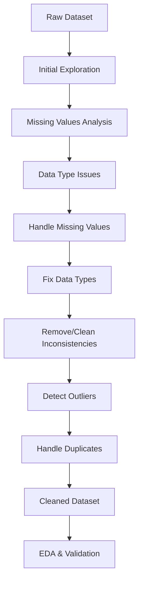

# Complete Guide: Data Pre-processing and Cleaning with Python

## Overview

This guide will walk you through the essential steps of data preprocessing and cleaning using your music tour dataset. We'll cover everything from initial exploration to advanced cleaning techniques.

## Dataset Overview

Your dataset contains information about the highest-grossing concert tours, with 20 rows and 11 columns including tour rankings, financial data, artists, and tour details.

## 🔍 Step 1: Initial Data Exploration

### 1.1 Loading and Basic Inspection

```python
import pandas as pd
import numpy as np
import matplotlib.pyplot as plt
import seaborn as sns

# Load the dataset
df = pd.read_csv('my_file 1.csv')

# Basic dataset information
print("Dataset Shape:", df.shape)
print("\nColumn Names:")
print(df.columns.tolist())
print("\nFirst 5 rows:")
print(df.head())
```

### 1.2 Essential Inspection Commands

|Function|Purpose|What it reveals|
|---|---|---|
|`df.info()`|Data types, non-null counts|Missing values, incorrect data types|
|`df.describe()`|Statistical summary|Outliers, data distribution|
|`df.head()`|First few rows|Data structure, formatting issues|
|`df.tail()`|Last few rows|Consistency throughout dataset|
|`df.shape`|Dimensions|Dataset size|
|`df.dtypes`|Data types|Type conversion needs|

```python
# Comprehensive inspection
print("=== DATA INFO ===")
df.info()

print("\n=== STATISTICAL SUMMARY ===")
df.describe(include='all')

print("\n=== NULL VALUES ===")
print(df.isnull().sum())

print("\n=== DATA TYPES ===")
print(df.dtypes)
```

### 1.3 Identifying Data Issues

Based on your dataset, here are the **key issues identified**:

1. **Missing Values**: `Peak` (11 missing) and `All Time Peak` (14 missing) columns have significant missing data
2. **Inconsistent Formatting**: Reference annotations like `[4]`, `‡`, `†` mixed with actual values
3. **Incorrect Data Types**: All numeric columns stored as strings due to currency symbols and commas
4. **Reference Contamination**: Values like `"1[4]"` contain both data and references

## 🧹 Step 2: Data Cleaning Workflow



## 🔧 Step 3: Handling Missing Values

### 3.1 Missing Values Detection

```python
# Detailed missing values analysis
def analyze_missing_values(df):
    missing_data = df.isnull().sum()
    missing_percent = (missing_data / len(df)) * 100
    
    missing_df = pd.DataFrame({
        'Missing Count': missing_data,
        'Missing Percentage': missing_percent
    })
    
    missing_df = missing_df[missing_df['Missing Count'] > 0].sort_values('Missing Count', ascending=False)
    return missing_df

print("Missing Values Analysis:")
print(analyze_missing_values(df))
```

### 3.2 Missing Values Strategies

|Strategy|When to Use|Pros|Cons|
|---|---|---|---|
|**Drop rows**|<5% missing, random pattern|Simple, no assumptions|Lose data|
|**Drop columns**|>50% missing, irrelevant|Removes problem entirely|Lose entire feature|
|**Forward fill**|Time series, logical sequence|Preserves trends|May introduce bias|
|**Mean/Median**|Numerical data, normal distribution|Quick, maintains distribution center|Reduces variance|
|**Mode**|Categorical data|Logical for categories|May increase mode frequency|
|**Interpolation**|Numerical sequences|More sophisticated|Complex, requires understanding|

```python
# Strategy for your dataset
def handle_missing_values(df):
    df_clean = df.copy()
    
    # Strategy 1: For Peak and All Time Peak columns
    # Since these appear to be ranking-related and many are missing,
    # we'll fill with a placeholder indicating "Not Available"
  df_clean['Peak'] = df_clean['Peak'].fillna('Not Available')
    df_clean['All Time Peak'] = df_clean['All Time Peak'].fillna('Not Available')  
    
    # Alternative strategies you could try:
    # df_clean['Peak'].fillna(df_clean['Peak'].mode()[0])  # Most frequent value
    # df_clean = df_clean.dropna(subset=['Peak'])  # Drop rows with missing Peak
    
    return df_clean

df_cleaned = handle_missing_values(df)
```

## 🔢 Step 4: Data Type Conversion

### 4.1 Identifying Type Issues

```python
# Examine problematic columns
print("Current data types:")
print(df.dtypes)

# Check unique values in problematic columns
print("\nSample values in 'Actual gross':")
print(df['Actual gross'].head())
```

### 4.2 Cleaning and Converting Numerical Columns

```python
def clean_financial_columns(df):
    """Clean and convert financial columns to numeric"""
    df_clean = df.copy()
    
    # List of financial columns
    financial_cols = ['Actual gross', 'Adjusted gross (in 2022 dollars)', 'Average gross']
    
    for col in financial_cols:
        # Remove currency symbols, commas, and convert to numeric
        df_clean[col] = (df_clean[col]
                        .str.replace('$', '', regex=False)
                        .str.replace(',', '', regex=False)
                        .astype(float))
    
    # Convert Shows to integer
    df_clean['Shows'] = df_clean['Shows'].astype(int)
    
    # Convert Rank to integer
    df_clean['Rank'] = df_clean['Rank'].astype(int)
    
    return df_clean

# Apply cleaning
df_cleaned = clean_financial_columns(df_cleaned)
print("Updated data types:")
print(df_cleaned.dtypes)
```

### 4.3 Cleaning Categorical Columns

```python
def clean_categorical_columns(df):
    """Remove reference annotations from categorical data"""
    df_clean = df.copy()
    
    # Clean Peak column - remove reference annotations
    df_clean['Peak_cleaned'] = (df_clean['Peak']
                               .str.replace(r'\[[^\]]*\]', '', regex=True)  # Remove [references]
                               .str.replace('†', '', regex=False)           # Remove symbols
                               .str.replace('‡', '', regex=False)
                               .str.strip())                                # Remove whitespace
    
    # Clean All Time Peak column
    df_clean['All_Time_Peak_cleaned'] = (df_clean['All Time Peak']
                                        .str.replace(r'\[[^\]]*\]', '', regex=True)
                                        .str.strip())
    
    # Clean Tour title column
    df_clean['Tour_title_cleaned'] = (df_clean['Tour title']
                                     .str.replace(r'\[[^\]]*\]', '', regex=True)
                                     .str.replace('†', '', regex=False)
                                     .str.replace('‡', '', regex=False)
                                     .str.strip())
    
    return df_clean

df_cleaned = clean_categorical_columns(df_cleaned)
```

## 📊 Step 5: Outlier Detection and Treatment

### 5.1 Statistical Outlier Detection

```python
def detect_outliers(df, columns):
    """Detect outliers using IQR method"""
    outlier_info = {}
    
    for col in columns:
        Q1 = df[col].quantile(0.25)
        Q3 = df[col].quantile(0.75)
        IQR = Q3 - Q1
        
        # Define outlier bounds
        lower_bound = Q1 - 1.5 * IQR
        upper_bound = Q3 + 1.5 * IQR
        
        # Find outliers
        outliers = df[(df[col] < lower_bound) | (df[col] > upper_bound)]
        
        outlier_info[col] = {
            'count': len(outliers),
            'percentage': (len(outliers) / len(df)) * 100,
            'bounds': (lower_bound, upper_bound),
            'outlier_values': outliers[col].tolist()
        }
    
    return outlier_info

# Detect outliers in numerical columns
numerical_cols = ['Actual gross', 'Adjusted gross (in 2022 dollars)', 'Shows', 'Average gross']
outlier_analysis = detect_outliers(df_cleaned, numerical_cols)

for col, info in outlier_analysis.items():
    print(f"\n{col}:")
    print(f"  Outliers: {info['count']} ({info['percentage']:.1f}%)")
    if info['count'] > 0:
        print(f"  Values: {info['outlier_values']}")
```

### 5.2 Outlier Treatment Options

```python
def handle_outliers(df, method='keep'):
    """
    Handle outliers using different strategies
    
    Methods:
    - 'keep': Keep all data (default for small datasets)
    - 'remove': Remove outlier rows
    - 'cap': Cap outliers at bounds
    - 'transform': Log transformation
    """
    df_clean = df.copy()
    
    if method == 'keep':
        print("Keeping all outliers (recommended for small dataset)")
        return df_clean
    
    elif method == 'remove':
        # Remove outliers (use cautiously with small datasets)
        for col in numerical_cols:
            Q1, Q3 = df_clean[col].quantile(0.25), df_clean[col].quantile(0.75)
            IQR = Q3 - Q1
            lower, upper = Q1 - 1.5*IQR, Q3 + 1.5*IQR
            df_clean = df_clean[(df_clean[col] >= lower) & (df_clean[col] <= upper)]
    
    elif method == 'cap':
        # Cap outliers at bounds
        for col in numerical_cols:
            Q1, Q3 = df_clean[col].quantile(0.25), df_clean[col].quantile(0.75)
            IQR = Q3 - Q1
            lower, upper = Q1 - 1.5*IQR, Q3 + 1.5*IQR
            df_clean[col] = df_clean[col].clip(lower=lower, upper=upper)
    
    return df_clean

# For your small dataset, we'll keep outliers
df_cleaned = handle_outliers(df_cleaned, method='keep')
```

## 🔍 Step 6: Duplicate Detection and Handling

```python
def check_duplicates(df):
    """Comprehensive duplicate analysis"""
    
    print("=== DUPLICATE ANALYSIS ===")
    print(f"Total rows: {len(df)}")
    print(f"Complete duplicates: {df.duplicated().sum()}")
    
    # Check for duplicates based on key columns
    key_columns = ['Artist', 'Tour title']  # Logical business keys
    key_duplicates = df.duplicated(subset=key_columns).sum()
    print(f"Duplicates based on {key_columns}: {key_duplicates}")
    
    if key_duplicates > 0:
        print("\nDuplicate records:")
        duplicates = df[df.duplicated(subset=key_columns, keep=False)]
        print(duplicates[key_columns + ['Year(s)', 'Actual gross']])
    
    return df.duplicated().sum()

# Check for duplicates
duplicate_count = check_duplicates(df_cleaned)

# Remove duplicates if found
df_cleaned = df_cleaned.drop_duplicates()
```

## 📈 Step 7: Exploratory Data Analysis (EDA)

### 7.1 Essential EDA Plots

```python
# Set up plotting style
plt.style.use('default')
sns.set_palette("husl")

# 1. Distribution Analysis
fig, axes = plt.subplots(2, 2, figsize=(15, 12))

# Gross revenue distribution
axes[0,0].hist(df_cleaned['Actual gross'], bins=15, alpha=0.7, color='skyblue')
axes[0,0].set_title('Distribution of Actual Gross Revenue')
axes[0,0].set_xlabel('Actual Gross ($)')
axes[0,0].set_ylabel('Frequency')

# Shows distribution
axes[0,1].hist(df_cleaned['Shows'], bins=15, alpha=0.7, color='lightgreen')
axes[0,1].set_title('Distribution of Number of Shows')
axes[0,1].set_xlabel('Number of Shows')
axes[0,1].set_ylabel('Frequency')

# Box plot for outlier visualization
axes[1,0].boxplot([df_cleaned['Actual gross']], labels=['Actual Gross'])
axes[1,0].set_title('Box Plot: Actual Gross Revenue')
axes[1,0].set_ylabel('Revenue ($)')

# Top artists by revenue
top_artists = df_cleaned.groupby('Artist')['Actual gross'].sum().sort_values(ascending=True).tail(10)
axes[1,1].barh(range(len(top_artists)), top_artists.values)
axes[1,1].set_yticks(range(len(top_artists)))
axes[1,1].set_yticklabels(top_artists.index)
axes[1,1].set_title('Top 10 Artists by Total Revenue')
axes[1,1].set_xlabel('Total Revenue ($)')

plt.tight_layout()
plt.show()
```

### 7.2 Correlation Analysis

```python
# Correlation heatmap for numerical variables
numerical_df = df_cleaned.select_dtypes(include=[np.number])

plt.figure(figsize=(10, 8))
correlation_matrix = numerical_df.corr()
sns.heatmap(correlation_matrix, 
            annot=True, 
            cmap='coolwarm', 
            center=0,
            fmt='.2f')
plt.title('Correlation Matrix of Numerical Variables')
plt.show()

# Interpretation
print("=== CORRELATION INSIGHTS ===")
high_corr_pairs = []
for i in range(len(correlation_matrix.columns)):
    for j in range(i+1, len(correlation_matrix.columns)):
        corr_val = correlation_matrix.iloc[i, j]
        if abs(corr_val) > 0.5:  # Threshold for high correlation
            high_corr_pairs.append((
                correlation_matrix.columns[i], 
                correlation_matrix.columns[j], 
                corr_val
            ))

for var1, var2, corr in high_corr_pairs:
    print(f"{var1} vs {var2}: {corr:.2f}")
```

### 7.3 Advanced EDA Insights

```python
# Year-wise analysis
def analyze_trends(df):
    """Analyze trends over time"""
    
    # Extract year from Year(s) column for analysis
    df['Start_Year'] = df['Year(s)'].str.extract(r'(\d{4})')
    df['Start_Year'] = pd.to_numeric(df['Start_Year'], errors='coerce')
    
    # Revenue trends by year
    plt.figure(figsize=(12, 6))
    
    plt.subplot(1, 2, 1)
    year_revenue = df.groupby('Start_Year')['Actual gross'].mean()
    plt.plot(year_revenue.index, year_revenue.values, marker='o')
    plt.title('Average Tour Revenue by Year')
    plt.xlabel('Year')
    plt.ylabel('Average Revenue ($)')
    plt.xticks(rotation=45)
    
    # Shows vs Revenue relationship
    plt.subplot(1, 2, 2)
    plt.scatter(df['Shows'], df['Actual gross'], alpha=0.7)
    plt.xlabel('Number of Shows')
    plt.ylabel('Actual Gross Revenue ($)')
    plt.title('Shows vs Revenue Relationship')
    
    # Add trend line
    z = np.polyfit(df['Shows'], df['Actual gross'], 1)
    p = np.poly1d(z)
    plt.plot(df['Shows'], p(df['Shows']), "r--", alpha=0.8)
    
    plt.tight_layout()
    plt.show()

analyze_trends(df_cleaned)
```

## ✅ Step 8: Final Data Validation

```python
def validate_cleaned_data(df_original, df_cleaned):
    """Validate the cleaning process"""
    
    print("=== DATA CLEANING VALIDATION ===")
    print(f"Original shape: {df_original.shape}")
    print(f"Cleaned shape: {df_cleaned.shape}")
    print(f"Rows removed: {df_original.shape[0] - df_cleaned.shape[0]}")
    
    print("\n=== MISSING VALUES COMPARISON ===")
    print("Original missing values:")
    print(df_original.isnull().sum())
    print("\nCleaned missing values:")
    print(df_cleaned.isnull().sum())
    
    print("\n=== DATA TYPES COMPARISON ===")
    print("Original dtypes:")
    print(df_original.dtypes)
    print("\nCleaned dtypes:")
    print(df_cleaned.dtypes)
    
    print("\n=== QUALITY SCORE ===")
    # Calculate a simple data quality score
    total_cells = df_cleaned.shape[0] * df_cleaned.shape[1]
    missing_cells = df_cleaned.isnull().sum().sum()
    quality_score = ((total_cells - missing_cells) / total_cells) * 100
    print(f"Data completeness: {quality_score:.1f}%")

# Run validation
validate_cleaned_data(df, df_cleaned)
```

## 🎯 Step 9: Complete Cleaning Pipeline

```python
def complete_data_cleaning_pipeline(file_path):
    """
    Complete data cleaning pipeline
    
    Args:
        file_path (str): Path to the CSV file
        
    Returns:
        pd.DataFrame: Cleaned dataset
    """
    
    # 1. Load data
    print("Step 1: Loading data...")
    df = pd.read_csv(file_path)
    print(f"Initial shape: {df.shape}")
    
    # 2. Handle missing values
    print("\nStep 2: Handling missing values...")
    df['Peak'] = df['Peak'].fillna('Not Available')
    df['All Time Peak'] = df['All Time Peak'].fillna('Not Available')
    
    # 3. Clean and convert data types
    print("Step 3: Converting data types...")
    financial_cols = ['Actual gross', 'Adjusted gross (in 2022 dollars)', 'Average gross']
    for col in financial_cols:
        df[col] = (df[col].str.replace('$', '', regex=False)
                          .str.replace(',', '', regex=False)
                          .astype(float))
    
    df['Shows'] = df['Shows'].astype(int)
    df['Rank'] = df['Rank'].astype(int)
    
    # 4. Clean categorical columns
    print("Step 4: Cleaning categorical data...")
    df['Peak_cleaned'] = (df['Peak']
                         .str.replace(r'\[[^\]]*\]', '', regex=True)
                         .str.replace('†‡', '', regex=False)
                         .str.strip())
    
    df['Tour_title_cleaned'] = (df['Tour title']
                               .str.replace(r'\[[^\]]*\]', '', regex=True)
                               .str.replace('†‡', '', regex=False)
                               .str.strip())
    
    # 5. Remove duplicates
    print("Step 5: Removing duplicates...")
    initial_rows = len(df)
    df = df.drop_duplicates()
    print(f"Removed {initial_rows - len(df)} duplicate rows")
    
    # 6. Final validation
    print(f"\nFinal shape: {df.shape}")
    print("Data types:", df.dtypes.to_dict())
    print("Missing values:", df.isnull().sum().to_dict())
    
    return df

# Run the complete pipeline
df_final = complete_data_cleaning_pipeline('my_file 1.csv')
```

## 📚 Summary & Best Practices

### Key Cleaning Decisions Made:

1. **Missing Values**: Filled with "Not Available" to preserve data integrity
2. **Data Types**: Converted financial columns to float, counts to integer
3. **Inconsistencies**: Removed reference annotations while preserving core data
4. **Outliers**: Kept all values due to small dataset size and domain relevance

### Best Practices Checklist:

- ✅ Always backup original data before cleaning
- ✅ Document all cleaning decisions and reasoning
- ✅ Validate data quality at each step
- ✅ Consider domain knowledge when making decisions
- ✅ Preserve data integrity over aggressive cleaning
- ✅ Create reusable cleaning functions
- ✅ Test cleaning pipeline on sample data first

### Next Steps:

1. **Feature Engineering**: Create derived features (revenue per show, year categories)
2. **Advanced Analysis**: Time series analysis, artist performance metrics
3. **Modeling**: Predict tour success, cluster similar tours
4. **Visualization**: Create comprehensive dashboards

This cleaned dataset is now ready for advanced analysis and machine learning applications!